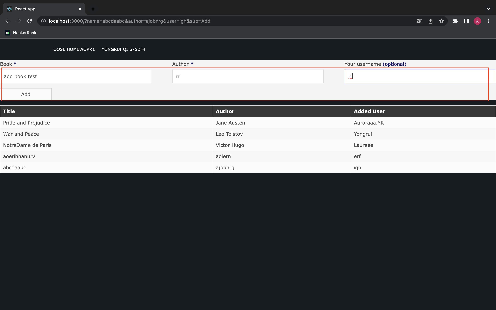

# Getting Started with MyBooks2

This project was bootstrapped with [Create React App](https://github.com/facebook/create-react-app).

### download

`git clone git@github.com:Auroraaa-Qi/MyBooks2.git`

### Getting into project directory

`cd MyBooks2` into project directory, you can run:

`cd src` into src folder;

`npm start` to run the app in the development mode. Open [http://localhost:3000](http://localhost:3000) to view it in your browser.

and then open another terminal, type in `node server.js` to start the server and connect to the database.

### illustrations

1.  input the title and auther to add new books:

    

2.  click "Add" and this book will display at the bottom of the table:

    

